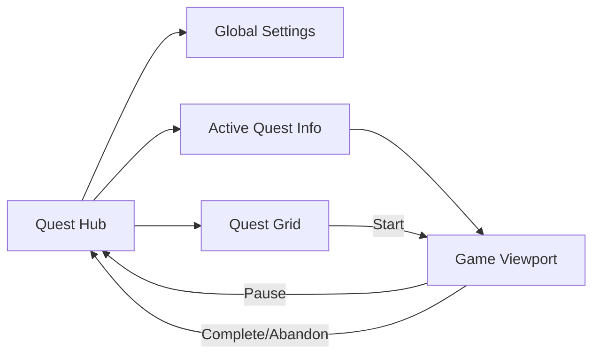

# 02 - UX and Navigation Flow

This document details the visual structure, interface components, and logical navigation flow of **Legacy's End**.

---

## 1. Initial Screen: The "Quest Hub" (Command Center)

The Hub is not a simple list; it is the dashboard where the user perceives their real progress.

The information presented here is dynamic and generated for each course (mission).

### 1.1 Hub Interface Structure

The initial page must follow this hierarchical layout:

1.  **Brand Header (Game Brand)**:
    - Displays the "LEGACY'S END" logo.
    - Access to global settings (Language, Sound, Profile).

2.  **Active Mission Info Section (Dynamic Hero)**:
    - If the user has an ongoing mission, it is highlighted at the top.
    - **Quest Title**: Epic mission name.
    - **Narrative Description**: The literary context and the technical problem (Code Smell).
    - **Progress Level**: Percentage or visual indicator (e.g., "Chapter 2 of 5").
    - **Estimated Duration**: Projected time to complete the remaining chapters.
    - **Action Button**: "Continue Mission" (takes you to the last saved point).

> **Note**: The player can only have **one active mission** at a time. To start another, they must complete or abandon the current one.

3.  **Course Catalogue (Quest Grid)**:
    - A grid system organizing missions in two categories:
      - **Available Courses**: Missions the player can start right now.
      - **Pending Courses / Coming Soon**: Visually locked missions (e.g., greyscale or with a padlock icon).

### 1.2 "Quest Card" Anatomy

Each mission card in the catalogue must display:

- **Thumbnail**: Representative art of the corruption level.
- **Title**: Attractive and technical (e.g., "The Global Scope Swamp").
- **Short Description**: The pedagogical objective.
- **Meta-info**: Total estimated duration and badge to be earned.
- **Lock Status**: If pending, must indicate which previous mission is required.

---

## 2. Action Screen: The "Game Viewport"

When entering a mission, the UI switches to an immersive full-screen mode (or dedicated container) with the following components:

### 2.1 The Stage

- **Rendering**: Area where Alarion moves.
- **Background**: Dynamic image that can change based on the mission state.
- **Sprites**: Visual representation of the hero, NPCs, and Rewards in % coordinates.

### 2.2 The HUD (Heads-Up Display)

Persistent information overlay:

- **Quest Progress Bar**: Bar that fills as mandatory interactions in the level are completed.
- **Pause/Menu Button**: Allows returning to the Hub or adjusting options without losing chapter progress.
- **Skills Indicator**: Icons of Rewards collected in the current chapter.

### 2.3 Dialogue System (Interaction Overlay)

- **Position**: Bottom or centered panel.
- **Components**: Portrait of the interlocutor, name, and text box.
- **Flow Control**: Visual indicator (blinking arrow) signaling more messages. The user must click or press a key to advance.

---

## 3. The Learning Path

Navigation is not free; it follows a **directed progression** business logic.

### 3.1 Hierarchical Unlocking

- **Activation Condition**: Mission `N+1` only changes from "Pending" to "Available" when the persistence engine marks mission `N` as `completed`.
- **Reward Dependency**: Some missions in the Path may require the hero to have a specific "Outfit" or skill obtained from a side course.

### 3.2 Transition Flow

1.  **Hub -> Game**: When pressing "Start", the mission bundle loads and the hero is placed at `startPos`.
2.  **Chapter N -> Chapter N+1**: Occurs automatically when entering the `ExitZone` (only after collecting the Reward).
3.  **Game -> Hub**: Happens when finishing the last chapter of a Quest or when manually abandoning. Upon return, the Home updates to show the new progress level and unlock the next course.

### 3.3 State Persistence (Autosave)

- Every time a dialogue ends or a Reward is collected, the `QuestController` must invoke the `StorageService`.
- **Persisted data**: Completed interactions (`completedInteractions[]`), hero position, collected rewards, current outfit/aura/skills.
- **Restoration**: On reload, the player returns to the same chapter, with completed interactions hidden and the hero at the saved position.
- This ensures that if the page refreshes, the user doesn't have to re-talk to NPCs they already "completed".
