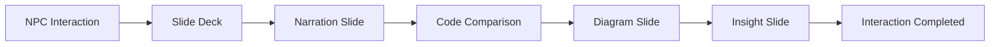

# 04 - Dialogue System and Slides

## 1. The "Slide Deck" Concept

In **Legacy's End**, dialogues are not simple text strings. They are **Slide Decks** composed of specialized components based on the type of educational content.

## 2. Deck Composition

Each interaction with an NPC or zone triggers a sequence of slides that the user must advance manually.

### 2.1 Slide Types (Slide Components)

For each type of educational content, there is a specific Lit component (PascalCase class, defined as custom element `le-*`):

- **NarrationSlide** (`le-narration-slide`): Atmospheric text screen with the NPC's portrait. Focus on narrative.
- **CodeComparisonSlide** (`le-code-comparison-slide`): Interactive component showing "Legacy Code" versus "Refactored Code". Allows highlighting differences.
- **DiagramSlide** (`le-diagram-slide`): Displays architecture schemas or flowcharts to explain abstract concepts (e.g., Dependency Injection).
- **InsightSlide** (`le-insight-slide`): Focus on a "Tip" or key takeaway from the mission.

> For the formal data schema of each slide type, see [07 - Data Contract § Slide Types](./07-data-contract.md#3-slide-types-full-schema).

## 3. Completion Logic

- **Manual Advance**: The player controls the pace by passing each slide.
- **Dialogue State**: An interaction is only marked as "Completed" when the last slide of the deck is reached.
- **Side Effects**: The end of a deck can trigger a change in the world (e.g., appearance of a Reward or background change).
