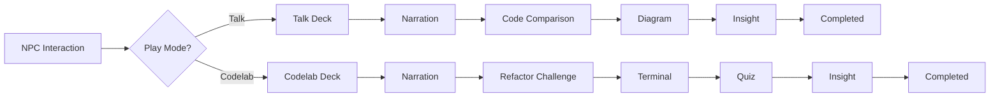

# 04 - Dialogue System and Slides

## 1. The "Slide Deck" Concept

In **Legacy's End**, dialogues are not simple text strings. They are **Slide Decks** composed of specialized components based on the type of educational content.

Each entity can offer **two deck variants** depending on the active play mode:

## 2. Play Modes

The same level content can be experienced in two complementary modes:

### 2.1 Talk Mode ("Charla")

Narrative-focused, passive experience. Ideal for a first playthrough or quick review.

- Uses: `narration`, `code-comparison`, `diagram`, `insight`.
- The player reads and absorbs concepts at their own pace.

### 2.2 Codelab Mode

Interactive, hands-on experience. Ideal for practice and retention.

- Uses: `narration`, `refactor-challenge`, `terminal`, `quiz`, `diff`, `insight`.
- The player actively participates by solving challenges and answering questions.

### 2.3 Mode Selection & Defaults

- **Default mode**: **Codelab**. All players start in interactive mode.
- **Talk mode**: Activated via URL parameter (`?mode=talk`) or by setting `playMode: "talk"` in `localStorage`. Primarily for the author/developer to preview content.
- **Persistence**: Once set, the mode is stored in `localStorage` and persists across sessions until changed.

### 2.4 Mode Behavior Differences

| Behavior                     | Codelab                     | Talk                        |
| :--------------------------- | :-------------------------- | :-------------------------- |
| **Progress tracking**        | ✅ Tracked and persisted    | ❌ Not tracked              |
| **Quest prerequisites**      | Enforced (unlock chain)     | All quests open             |
| **Interaction requirements** | Enforced (skills, rewards)  | Bypassed                    |
| **Replay**                   | Can replay completed quests | Can access any quest freely |

## 3. Slide Types (Slide Components)

For each type of educational content, there is a specific Lit component (PascalCase class, defined as custom element `le-*`):

### 3.1 Shared Slides (Both Modes)

- **NarrationSlide** (`le-narration-slide`): Atmospheric text screen with the NPC's portrait. Focus on narrative.
- **InsightSlide** (`le-insight-slide`): Focus on a "Tip" or key takeaway from the mission.

### 3.2 Talk Mode Slides

- **CodeComparisonSlide** (`le-code-comparison-slide`): Side-by-side view of "Legacy Code" versus "Refactored Code". Allows highlighting differences. Passive observation.
- **DiagramSlide** (`le-diagram-slide`): Displays architecture schemas or flowcharts to explain abstract concepts (e.g., Dependency Injection).

### 3.3 Codelab Mode Slides

- **QuizSlide** (`le-quiz-slide`): Multiple-choice question about the concept just taught. Non-blocking — gives visual feedback (✅/❌) and allows retry.
- **RefactorChallengeSlide** (`le-refactor-challenge-slide`): Shows broken code and the player selects which line to fix or which pattern to apply. Hands-on interaction.
- **TerminalSlide** (`le-terminal-slide`): Simulates console output (error logs, test results). The player reads and interprets the output to understand the problem.
- **DiffSlide** (`le-diff-slide`): Git-style diff with `+`/`-` colored lines. Shows the concrete changes when applying a pattern.

> For slide data examples, see [07 - Data Contract § Chapter Messages](./07-data-contract.md#34-chapter-messages-chaptersmessagesjs).

## 4. Completion Logic

- **Manual Advance**: The player controls the pace by passing each slide.
- **Codelab Interaction**: Quiz and Refactor slides require the player to submit an answer before advancing. Incorrect answers show feedback but do not block progress.
- **Dialogue State**: An interaction is only marked as "Completed" when the last slide of the active deck is reached.
- **Side Effects**: The end of a deck can trigger a change in the world (e.g., appearance of a Reward or background change). Side effects are the same regardless of mode.
