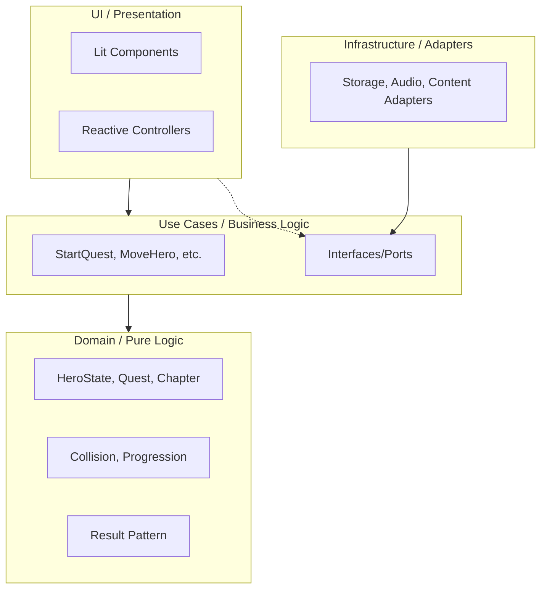

# 05 - Architecture and Code Standards

> ℹ️ **Note on implementation status**: This architecture is the project's target standard. Currently, the project is in the initial infrastructure phase, and the layers described below will be implemented following this pattern.

## 1. Clean Architecture (The Desirable Pattern)

The project is based on a unidirectional (inward) dependency flow.



The use of "signals" is prohibited in the **Domain** and **Use Cases** layers to keep them pure and without reactive framework dependencies. In the **Infrastructure** layer, signals can be used as a reactive bridge between use cases and the UI (see §1.3). In the UI layer, Lit manages reactivity internally using `@property`, `@state`, and `ReactiveController`.

### 1.1 The 4 Layers

1.  **Domain (`src/domain`)**:
    - Contains pure entities (`HeroState`, `Quest`, `Chapter`), value objects (`Position`, `VisibilityCondition`), pure logic (collisions, progression), and typed errors.
    - **Result Pattern**: Mandatory. Functions never throw exceptions; they return a result object `{ success, value, error }`.
    - **Implementation Example**:

    ```javascript
    // src/domain/result.js
    export const Result = {
      success: (value) => ({ success: true, value, error: null }),
      failure: (error) => ({ success: false, value: null, error }),
    };
    ```

    - Does not depend on any other layer or framework.

2.  **Use Cases (`src/use-cases`)**:
    - Orchestrate business rules (e.g., `evaluate-chapter-transition.js`).
    - Are independent of frameworks and infrastructure.
    - **Define Ports** (interfaces) that infrastructure must implement, located in `src/use-cases/ports/`.

3.  **Infrastructure (`src/infrastructure`)**:
    - **Adapters** for the outside world (Storage, Content loading, Audio).
    - Implement the ports defined by the Use Cases layer so the system remains provider-agnostic.

4.  **UI / Presentation (`src/ui`)**:
    - **Dumb Components** (`src/ui/components/`): Lit elements only receive `@property` and emit events. They are unaware of business logic.
    - **Controllers** (`src/ui/controllers/`): Lit `ReactiveController`s that connect the UI with Use Cases via **Dependency Injection** using `@lit/context`.
    - **Router** (`src/ui/router/`): Navigation management between views (Hub ↔ Game Viewport).

### 1.2 Composition Root

Dependency assembly is performed in `src/composition-root.js`. This file:

- Instantiates infrastructure adapters.
- Injects them into use cases.
- Provides `@lit/context` contexts to the UI.

### 1.3 Signals Policy

**Signals** (e.g., `@lit-labs/signals` or another implementation based on the `TC39 Signals proposal`) are allowed **exclusively in the Infrastructure layer** as a reactive mechanism to:

- Efficiently expose game state to the UI (e.g., hero position, visible entities).
- Avoid unnecessary re-renders in components observing frequent data.

**Prohibited** in:

- `src/domain/` — Entities and logic must be pure functions.
- `src/use-cases/` — Use cases receive and return flat data, without reactive subscriptions.

### 1.4 Folder Structure

```
src/
├── domain/                    # Layer 1: Pure Domain
│   ├── entities/              # HeroState, Quest, Chapter, GameEntity, Slide
│   ├── value-objects/         # Position, VisibilityCondition, Outfit
│   ├── logic/                 # Collisions, progression (pure functions)
│   ├── errors/                # Catalogue of typed errors
│   └── result.js              # Result pattern
│
├── use-cases/                 # Layer 2: Use Cases
│   ├── ports/                 # Interfaces defined by the business layer
│   ├── start-quest.js
│   ├── move-hero.js
│   └── ...
│
├── infrastructure/            # Layer 3: Adapters
│   ├── storage/
│   ├── content/
│   └── audio/
│
├── ui/                        # Layer 4: Presentation
│   ├── components/            # Web Components (Lit + Web Awesome)
│   ├── controllers/           # ReactiveControllers (Lit)
│   └── router/                # Hub ↔ Game Navigation
│
├── content/                   # Mission data (outside the 4 layers)
│   └── quests/
│
├── assets/                    # Sprites, audio, backgrounds
├── composition-root.js        # DI Assembly
└── main.js                    # Entry point
```

## 2. Code Standards ("Jorge Casar Persona")

### 2.1 Naming Conventions

- **Files**: `kebab-case.js` (e.g., `move-hero.js`).
- **Classes**: `PascalCase` (e.g., `class StartQuest`, `class GameViewport`).
- **Functions**: `camelCase` (e.g., `moveHero()`, `evaluateVisibility()`).
- **Components**: `PascalCase` for the class and `kebab-case` for the tag (e.g., `class GameViewport` -> `le-game-viewport`).
- **Styles**: `[component-name].styles.js` (e.g., `game-viewport.styles.js`).
- **Variables**: `camelCase`.
- **Constants**: `UPPER_SNAKE_CASE`.

### 2.2 Syntax Requirements

- **TC39 Decorators**: Mandatory use of `accessor` in decorated fields (e.g., `@state() accessor name = ""`).
- **Separate Styles**: Always in independent files.
- **Immutability**: States are only modified through authorized controllers to preserve domain integrity.
