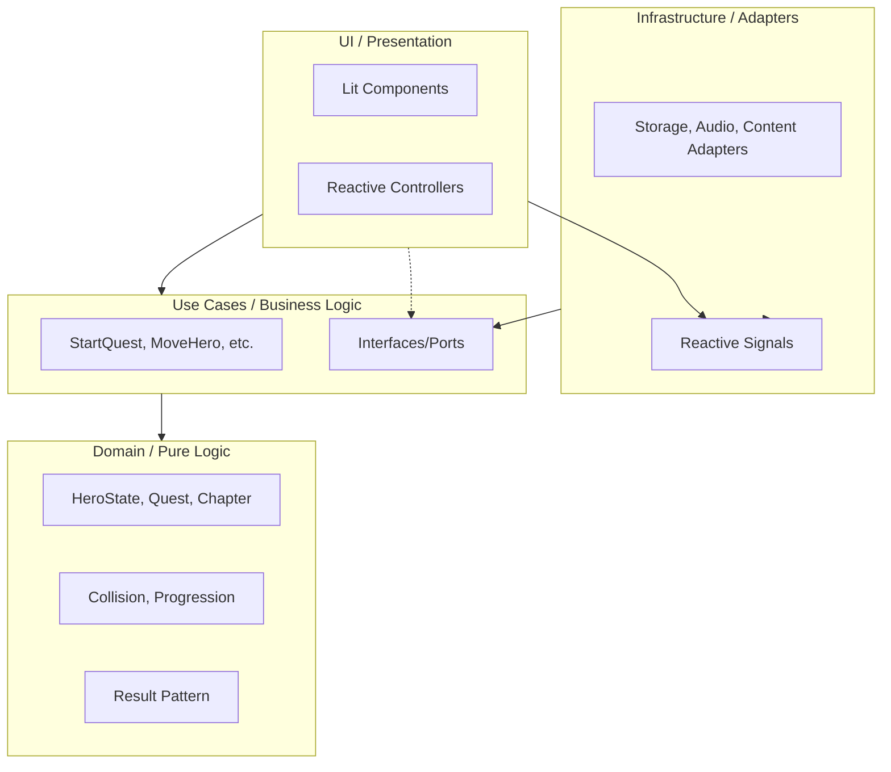

# 05 - Architecture and Code Standards

This document defines the mandatory standards for Legacy's End. All new features must follow the pattern established in `packages/feature-quest-hub`.

## 1. Modular Monorepo Architecture (Vertical Slices)

The project is structured as a modular monorepo using the `@legacys-end` namespace. This approach combines **Clean Architecture** with **Vertical Slices** to ensure high modularity, clear dependencies, and incremental delivery.

### 1.1 Dependency Flow Diagram



### 1.2 Package Hierarchy & Responsibility

| Package                       | Responsibility                                                     | Export Policy               |
| :---------------------------- | :----------------------------------------------------------------- | :-------------------------- |
| `@legacys-end/core`           | Technical primitives (Result, Errors).                             | Only logic. No UI/Infra.    |
| `@legacys-end/domain`         | **Shared** entities and pure logic (Hero, Session).                | Pure JS. No framework deps. |
| `@legacys-end/use-cases`      | **Shared** business orchestration (InitializeGame, SaveProgress).  | Ports/Interfaces only.      |
| `@legacys-end/theme`          | Visual system, CSS tokens, multi-theme support.                    | CSS & Style Objects.        |
| `@legacys-end/ui`             | Shared UI atoms (Web Awesome wrappers).                            | Lit Components.             |
| `@legacys-end/infrastructure` | Shared services (Storage, Audio, Asset Loader).                    | Implementation classes.     |
| `@legacys-end/content`        | Game script: quest data (JSON) + translatable text (.messages.js). | Data only. No logic.        |
| `@legacys-end/feature-*`      | autonomous functional modules.                                     | UI + Context Keys.          |
| `@legacys-end/game-app`       | **Composition Root**. Assembles all modules.                       | Final executable bundle.    |

### 1.3 Domain Promotion & The "Rule of Two"

Logic and entities follow a "local-first" policy:

- **Phase 1 (Local)**: Everything lives inside the `feature` package.
- **Phase 2 (Evaluation)**: If a second, unrelated feature requires the same logic/entity, it is **promoted** to a shared package (`@legacys-end/domain` or `@legacys-end/use-cases`).
- **Rule**: Direct sibling dependencies between features are strictly forbidden.

## 2. Dependency Injection & Reactivity

### 2.1 Dependency Injection (DI) with Lit Context

We use `@lit/context` to decouple components from business logic:

- **Providers**: High-level containers or the `game-app` provide implementations (Use Cases, Services).
- **Consumers**: UI components use the `@consume` decorator to request their dependencies. Components must consume Use Case interfaces, never implementations.

### 2.2 Real-time State vs. Persistent State

- **Real-time State (Signals)**: High-frequency data (coordinates, animations, input). Managed in **Infrastructure** and observed in **UI**.
- **Persistent State (Services)**: Narrative progress, inventory, rewards. Orchestrated by **Use Cases** and persisted via **Infrastructure Services**.

## 3. Communication Lifecycle (The 6 Steps)

1.  **User Action (UI)**: Component dispatches an event or calls an **Injected Use Case**.
2.  **Orchestration (Use Case)**: Evaluates the business rule. Calls a **Port** (Interface).
3.  **Data Retrieval (Infra)**: The Adapter implementer fetches data (Content/Storage).
4.  **Business Logic (Domain)**: Pure entity validation via the **Result Pattern**.
5.  **Persistence (Use Case)**: If valid, the Use Case instructs Infra to save the state.
6.  **Reactive Update (Signals)**: Infra updates a **Signal**. The UI re-renders automatically.

## 4. Clean Architecture Layers (Internal Folder Structure)

Every feature package must follow this structure for consistency:

```text
src/
├── domain/                    # Layer 1: Pure Domain
│   ├── entities/              # Entities specific to this package
│   ├── value-objects/         # Immutables (Position, Reward)
│   └── logic/                 # Pure functions, Result type. No external dependencies.
│
├── use-cases/                 # Layer 2: Business Logic
│   ├── ports/                 # Interfaces/Ports (Input/Output)
│   └── [use-case].js          # Interactors/Orchestrators
│
├── infrastructure/            # Layer 3: Adapters
│   └── [adapter].js           # Concrete implementations of ports
│
└── ui/                        # Layer 4: Presentation
    ├── components/            # Lit Components
    ├── controllers/           # ReactiveControllers
    ├── stories/               # Storybook Stories
    └── [ComponentName].styles.js # Component styles
```

## 5. The Result Pattern (Mandatory)

All functions in Domain, Use Cases, and Infrastructure must return a `Result<T>` object. Use strings for error messages or specialized Domain Errors.

```javascript
/** @typedef {import("../domain/Result.js").Result<Data>} DataResult */
async execute(): Promise<DataResult> {
  // ...
  return { success: true, value: data };
}
```

## 6. Domain Entities & Value Objects

- **Value Objects**: Use them for IDs and complex attributes. Must have a static `create()` method.
- **Entities**: Protect invariants using a private constructor and a static `create()` factory that returns a `Result`.
- **Naming**: Contracts (Abstract Classes) take the base name (e.g., `QuestRepository`). Implementations use a technical suffix (e.g., `StaticQuestRepository`).

## 7. UI Components (Lit)

- **Asynchrony**: Always use `@lit/task` for data fetching. Handle all states: `initial`, `pending`, `error`, and `complete`.
- **Events**: Define Custom Events in the domain layer when they represent business actions (e.g., `QuestSelectedEvent`).
- **Component Library**: Always prioritize using **Web Awesome** components for standard UI elements (buttons, inputs, dialogs, layout utilities like `wa-stack`, etc.) rather than building custom components from scratch. Custom `le-*` components should wrap or compose Web Awesome components whenever possible.

## 8. Coding Style & Typing

- **JSDoc**: Mandatory for all files. Group `@typedef` at the top of the file, right after imports.
- **No `any`**: Be specific with types. Use `unknown` or `Record<string, unknown>` only if strictly necessary.
- **Naming Conventions**:
    - **Files**: `kebab-case.js` (e.g., `move-hero.js`).
    - **Classes**: `PascalCase` (e.g., `class StartQuest`).
    - **Functions**: `camelCase` (e.g., `moveHero()`).
    - **Components**: `PascalCase` class, `kebab-case` tag with `le-` prefix (e.g., `le-game-viewport`).
- **Decorators**: Always use `accessor` for decorated fields (e.g., `@state() accessor name = ""`).

## 9. Testing Strategy

- **100% Logic Coverage**: Mandatory for `domain/` and `use-cases/`.
- **BDD**: Use Cucumber for acceptance tests, running against Storybook stories for UI isolation.
- **Unit Tests**: Use Node.js native test runner (`node --test`).
