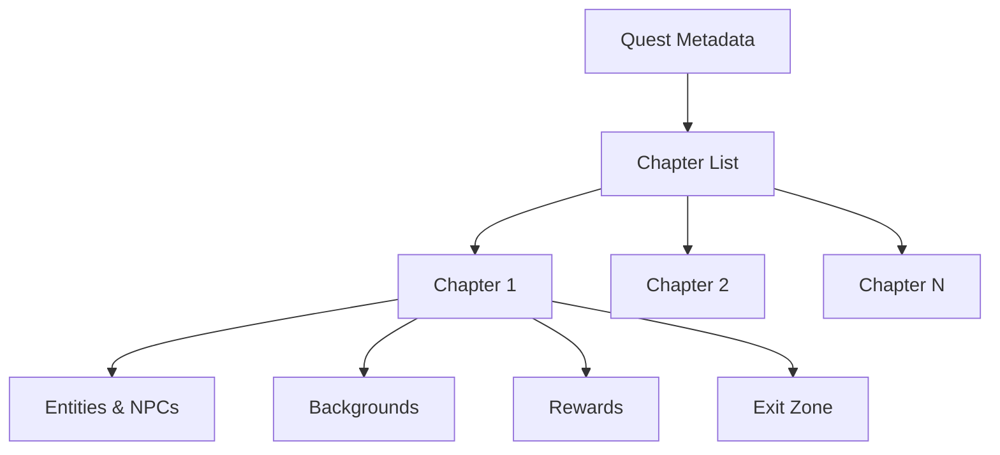

# 07 - Data Contract (Content)

## 1. Domain Entities

### 1.1 HeroState

Protagonist's state. It is the root entity that persists between sessions.

```javascript
/** @typedef {Object} HeroState */
{
  "id": "alarion",
  "name": "Alarion",
  "position": { "x": 10, "y": 50 },     // % Coordinates (0-100)
  "outfit": "base",                       // Active outfit
  "aura": null,                           // Visual effect (null = none)
  "skills": [],                           // Skill[] — unlocked skills
  "activeQuestId": "quest-scope-global",  // Ongoing mission ID (null = none)
  "activeChapterId": "chapter-1",         // Current chapter ID
  "completedInteractions": ["npc-1"]      // IDs of already completed interactions
}
```

### 1.2 Skill (Architectural Skill)

Engineering concept unlocked as a reward.

```javascript
/** @typedef {Object} Skill */
{
  "id": "encapsulation-shield",
  "name": "Encapsulation Shield",
  "description": "You master the encapsulation principle...",
  "icon": "shield-icon"                   // Asset icon reference
}
```

## 2. Quest Structure



To create a new mission, an object must be defined in `src/content/quests/` following this contract:

### 2.1 Quest Metadata (`index.js`)

Each mission is an autonomous object defining its own presentation information for the Hub:

```javascript
/** @typedef {"locked"|"available"|"in_progress"|"completed"} QuestStatus */
{
  "id": "quest-scope-global",
  "title": "The Global Scope Swamp",
  "description": "Narrative and technical problem (Code Smell) explanation.",
  "estimatedDuration": "15 min",
  "badge": "Encapsulation Shield",               // Name of the Skill to be earned
  "prerequisites": ["previous-quest-id"],        // Quests that must be "completed"
  "chapters": ["chapter-1", "chapter-2"],        // Chapter IDs in order
  "status": "available"                          // locked | available | in_progress | completed
}
```

**Quest State Diagram:**

```
locked → available → in_progress → completed
                   ↗ (abandonment)
```

### 2.2 Chapter Configuration (`chapters.js`)

The schema allows orchestrating visual and sequential evolution:

```javascript
/** @typedef {Object} Chapter */
{
  "chapter-1": {
    "startPos": { "x": 10, "y": 50 },           // Hero's starting position
    "backgrounds": [
      { "id": "corrupt", "style": "url(...)", "condition": "default" },
      { "id": "healed", "style": "url(...)", "condition": "all_interactions_done" }
    ],
    "heroOverrides": {
      "onEnter": { "outfit": "base" }           // Outfit upon starting the chapter
    },
    "entities": [
      {
        "id": "npc-1",
        "type": "npc",
        "position": { "x": 30, "y": 50 },
        "visibility": "always",
        "deck": [
          { "type": "narration", "speaker": "Master Kael", "portrait": "kael.png", "text": "Welcome..." },
          { "type": "code-comparison", "title": "Global vs Local Scope", "before": "var x = 1;", "after": "const x = 1;", "highlights": [1] },
          { "type": "diagram", "title": "Dependency Injection", "imageUrl": "assets/diagrams/di.png", "alt": "DI Diagram" },
          { "type": "insight", "icon": "💡", "category": "SOLID Principle", "text": "The dependency inversion principle..." }
        ]
      },
      {
        "id": "npc-2",
        "type": "npc",
        "position": { "x": 70, "y": 20 },
        "visibility": "after:npc-1",             // Appears when npc-1 finishes
        "deck": [...]
      }
    ],
    "rewards": [
      {
        "id": "main-reward",
        "position": { "x": 50, "y": 50 },
        "visibility": "all_interactions_done",    // Only appears when everything is complete
        "effects": {
          "outfit": "advanced_armor",             // Outfit change (optional)
          "skill": "encapsulation-shield",        // Unlocked skill (optional)
          "aura": "clean-code-glow"               // Visual effect (optional)
        }
      }
    ],
    "exitZone": {
      "x": 90, "y": 50, "width": 10, "height": 20,
      "visibility": "reward_collected"            // Only active after collecting reward
    }
  }
}
```

## 3. Slide Types (Full Schema)

| Type              | Mandatory Fields           | Optional Fields                   |
| ----------------- | -------------------------- | --------------------------------- |
| `narration`       | `text`, `speaker`          | `portrait`                        |
| `code-comparison` | `title`, `before`, `after` | `highlights` (lines to highlight) |
| `diagram`         | `title`, `imageUrl`, `alt` | `caption`                         |
| `insight`         | `text`, `category`         | `icon`                            |

## 4. Visibility Conditions

| Predicate                 | Semantics                                               |
| ------------------------- | ------------------------------------------------------- |
| `"always"`                | Always visible                                          |
| `"after:<entity_id>"`     | Visible after completing interaction with `<entity_id>` |
| `"sequential"`            | Appears according to order in the `entities` array      |
| `"all_interactions_done"` | Visible when all mandatory interactions are completed   |
| `"reward_collected"`      | Visible when the chapter reward has been collected      |

## 5. Content Creation Guide (Workflow)

To add a new mission to the game:

1.  **Create Folder**: Create a subfolder in `src/content/quests/[mission-name]/`.
2.  **Define Metadata**: Create an `index.js` file exporting the Quest configuration.
3.  **Define Chapters**: Create a `chapters.js` file with the array of chapters and their entities/decks.
4.  **Prepare Assets**: Add backgrounds, portraits, and diagrams in the `assets/` subfolder:
    - **Backgrounds**: PNG, resolution according to viewport (e.g., 1920×1080 for HD).
    - **Portraits**: PNG with transparency, 128×128px minimum.
    - **Sprites**: 32×32px with `image-rendering: pixelated` (see doc 06 §4).
    - **Audio**: OGG/MP3 (with AAC fallback).
5.  **Register in the Hub**: Ensure the infrastructure `ContentService` includes the new folder in its loading process.

**Recommended file structure:**

```
src/content/quests/quest-scope-global/
├── index.js          # Exports Quest metadata
├── chapters.js       # Exports chapter logic
└── assets/           # Images, audio, and diagrams for this mission
    ├── backgrounds/
    ├── portraits/
    └── diagrams/
```
