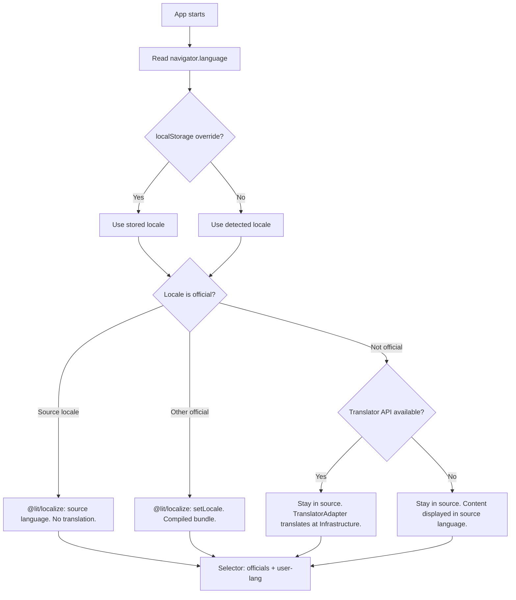

# 11 - Accessibility and i18n

> ℹ️ **Note on implementation status**: These accessibility and i18n guidelines will be applied during the UI and Components development phase. Tools such as `@lit/localize` have not been installed yet (see [Roadmap](./12-roadmap.md)).

## 1. Accessibility (a11y)

### 1.1 Keyboard Navigation

- All interactive elements must be reachable with `Tab`.
- The Game Viewport captures focus and manages controls via `keydown`.
- Web Awesome components already implement native ARIA roles.

### 1.2 ARIA and Semantics

- The stage (`le-stage`) must have `role="application"` and a descriptive `aria-label`.
- Dialogue slides must use `role="dialog"` with `aria-live="polite"` for screen readers.
- Progress indicators must use `role="progressbar"` with `aria-valuenow`.
- Quest Cards must have `aria-disabled="true"` when locked.

### 1.3 Contrast and Visuals

- Minimum contrast ratio: **4.5:1** for normal text, **3:1** for large text.
- Interaction indicators (bubbles) should not depend solely on color; use icons or text as well.
- High contrast mode: respect the `prefers-contrast` media query.

### 1.4 Reduced Motion

- Respect `prefers-reduced-motion`:
  - Disable hero CSS transition animations.
  - Immediate discrete movement (no `transition`).
  - Keep functionality intact.

## 2. Internationalization (i18n)

### 2.1 Strategy

- Use [`@lit/localize`](https://lit.dev/docs/localization/overview/) in **runtime mode** — locale modules are loaded dynamically, enabling hot-swap with `setLocale()` and the synthetic locale module approach for AI-translated languages (see §2.6-2.8).

### 2.2 Language & Locale Policy

- **Source Locale**: The primary development language is **English (`en`)**. All base strings in code and documentation use English as the source of truth.
- **Target Locales**: Spanish (`es`) is the primary target for localization, reflecting the project's roots and target audience.
- **Content vs UI**:
  - **UI Strings**: Managed via `@lit/localize` using `msg()` (e.g., button labels, menu items).
  - **Narrative Content**: Translatable strings in the `@legacys-end/content` package live in companion `.messages.js` files alongside their `.json` data files. All user-facing text is wrapped with `msg()` for extraction. See [ADR 003](./adr/003-content-localization-strategy.md).

### 2.3 Setup

```bash
npm install @lit/localize
npm install -D @lit/localize-tools
```

`lit-localize.json` file in the root:

```json
{
  "sourceLocale": "en",
  "targetLocales": ["es"],
  "tsConfig": "jsconfig.json",
  "output": {
    "mode": "runtime",
    "outputDir": "src/i18n/generated"
  }
}
```

### 2.4 Use in Components

```javascript
import { msg } from "@lit/localize";

// In render:
html`<button>${msg("Continue Mission")}</button>`;
```

### 2.5 Extraction and Compilation

```bash
npx lit-localize extract   # Generates XLIFF for translation
npx lit-localize build     # Compiles translations
```

### 2.6 Language Selection & Detection

- **Auto-detection**: On first load, the game reads `navigator.language` and uses it as the active locale.
- **Official locales**: All locales configured as `targetLocales` in `lit-localize.json` (initially `es`, with `en` as `sourceLocale`). Adding a new locale to the config and providing XLIFF translations automatically makes it official.
- **Hot-swap**: `@lit/localize`'s `setLocale()` allows runtime language switching for any official locale. Selecting a language triggers an immediate re-render — no page reload.
- **Language selector** (Hub header): **Always** displays:
  - All official locales (from `lit-localize.json`)
  - 🌐 _[User's language]_ — only if `navigator.language` is not among officials. Shows:
    - 🤖 AI badge if Translator API is available (translated on-device)
    - ⚠️ "English content" label if Translator is unavailable (displays in source language)
- **Persistence**: Selected locale is stored in `localStorage` and takes priority over auto-detection on subsequent loads.

### 2.7 Locale Resolution Flow



**Key architectural detail**: `@lit/localize` in **runtime mode** loads locale modules dynamically. For non-official locales, we generate a **synthetic locale module** using the Translator API:

1. `lit-localize extract` produces the full list of translatable strings (at build time).
2. On startup, if locale is not official, the `TranslatorAdapter` bulk-translates all extracted strings via the Translator API.
3. A synthetic locale module (same shape as compiled XLIFF modules) is generated in memory.
4. `setLocale()` loads this synthetic module — `msg()` resolves translations exactly as with official locales.
5. The synthetic module is cached in `localStorage`/IndexedDB so subsequent loads don't re-translate.

This means **zero changes in components** — `msg()` works identically for official and AI-translated locales. Both UI strings and content strings from `.messages.js` benefit from the same mechanism.

### 2.8 Reactivity on Language Change

When the user switches language mid-game, `msg()` handles everything uniformly:

| Locale Type                | Module Source                        | `setLocale()` → re-render |
| :------------------------- | :----------------------------------- | :------------------------ |
| **Source** (en)            | Built-in                             | ✅ Instant                |
| **Official** (es, ...)     | XLIFF-compiled                       | ✅ Instant                |
| **AI-generated** (fr, ...) | Synthetic module from Translator API | ✅ Instant (from cache)   |

**Flow on language change:**

1. User selects new locale in selector.
2. `setLocale(newLocale)` is called.
3. If official → loads compiled module. If AI → loads cached synthetic module (or generates on first switch).
4. `msg()` resolves from new module → Lit re-renders all components automatically.
