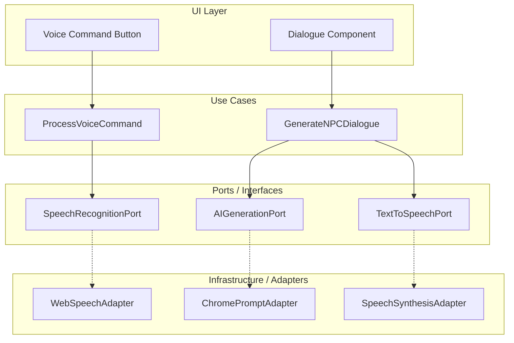

# 17 - Built-in AI (In-Game Intelligence)

> ℹ️ **Note on implementation status**: This feature depends on Chrome's Built-in AI APIs, some of which are in origin trial. Implementation is planned for **Phase 4** (see [Roadmap](./12-roadmap.md)).

## 1. Vision

Legacy's End uses **Chrome's Built-in AI** to make the game world feel alive and responsive. All AI processing happens **client-side** (on-device via Gemini Nano), requiring no backend, no API keys, and no cost per interaction.

Three capabilities:

| Capability                  | Input                        | Output                       | API                                  |
| :-------------------------- | :--------------------------- | :--------------------------- | :----------------------------------- |
| **Voice Commands**          | Player speaks                | Game action (move, interact) | Web Speech API (`SpeechRecognition`) |
| **NPC Dialogue Generation** | Level context + player state | Dynamic NPC dialogue         | Prompt API (Gemini Nano)             |
| **NPC Voice**               | Generated text               | Spoken audio                 | Web Speech API (`SpeechSynthesis`)   |
| **Auto-Translation**        | English content              | Content in user's language   | Translator API (Chrome stable)       |

## 2. Architecture (Clean Architecture Alignment)

Built-in AI follows the same layered architecture as the rest of the game:



### 2.1 Ports (Use Cases Layer)

```javascript
// use-cases/ports/ai-generation.port.js
/** @typedef {Object} AIGenerationPort */
// generate(prompt: string, context: object): Promise<Result<string>>

// use-cases/ports/speech-recognition.port.js
/** @typedef {Object} SpeechRecognitionPort */
// listen(): Promise<Result<string>>
// stop(): void

// use-cases/ports/text-to-speech.port.js
/** @typedef {Object} TextToSpeechPort */
// speak(text: string, options?: { lang, rate, pitch }): Promise<Result<void>>
```

### 2.2 Adapters (Infrastructure Layer)

| Adapter                  | Implements              | Browser API                           |
| :----------------------- | :---------------------- | :------------------------------------ |
| `WebSpeechAdapter`       | `SpeechRecognitionPort` | `window.SpeechRecognition`            |
| `ChromePromptAdapter`    | `AIGenerationPort`      | `LanguageModel.create()` (Prompt API) |
| `SpeechSynthesisAdapter` | `TextToSpeechPort`      | `window.speechSynthesis`              |

## 3. Voice Commands

The player can speak commands instead of using keyboard/touch:

| Voice Command             | Mapped Action        | Example                           |
| :------------------------ | :------------------- | :-------------------------------- |
| "move right/left/up/down" | `MoveHero` Use Case  | "Move right" → hero moves +2% X   |
| "talk" / "interact"       | `InteractWithEntity` | "Talk" → opens nearest NPC's deck |
| "open inventory"          | `ToggleInventory`    | "Open inventory" → shows skills   |

### 3.1 Command Resolution Flow

1. `WebSpeechAdapter.listen()` captures raw transcript.
2. `ProcessVoiceCommand` Use Case normalizes the text and matches it against a known command map.
3. If matched → dispatches the corresponding game action.
4. If unmatched → no action (optional: visual feedback "Command not recognized").

## 4. NPC Dialogue Generation

When interacting with an NPC, the Prompt API can generate **contextual dialogue** based on the level state:

### 4.1 Prompt Construction

The Use Case builds a system prompt with:

- **NPC personality** (from content data: name, role, archetype)
- **Level context** (current quest, chapter, corruption type)
- **Player state** (skills acquired, outfit, completed interactions)
- **Pedagogical goal** (the concept being taught in this chapter)

```javascript
const prompt = `You are ${npc.name}, a ${npc.role} in a world corrupted by legacy code.
The player has skills: ${hero.skills.join(", ")}.
Current chapter teaches: ${chapter.concept}.
Respond in character, briefly, referencing the concept of "${chapter.concept}".`;
```

### 4.2 Initial Audio Scope

Initially, audio is limited to **NPC interaction**:

- When the player opens an NPC's slide deck and "spoken mode" is enabled, the dialogue text is read aloud via `SpeechSynthesis`.
- No background music or SFX in the initial implementation.
- Future phases may add ambient audio, SFX triggers, and background music.

## 5. Settings & Controls

### 5.1 Spoken Mode Selector

The Hub's **Global Settings** panel includes an audio/voice section that adapts based on detected API availability:

| API Status                              | Setting Shown                  | Default |
| :-------------------------------------- | :----------------------------- | :------ |
| `SpeechSynthesis` available             | **🔊 NPC Voice** toggle        | Off     |
| `SpeechRecognition` available           | **🎤 Voice Commands** toggle   | Off     |
| `LanguageModel` (Prompt API) available  | **🤖 AI Dialogue** toggle      | Off     |
| `Translator` available + locale ≠ en/es | **🌐 Auto-Translate** toggle   | On      |
| None available                          | Section hidden, text-only mode | —       |

### 5.2 Capability Detection

Each adapter checks availability at startup and reports to the settings controller:

```javascript
// infrastructure/chrome-prompt-adapter.js
async function isAvailable() {
  if (!("LanguageModel" in self)) return false;
  const status = await LanguageModel.availability();
  return status !== "unavailable";
}

// infrastructure/web-speech-adapter.js
function isTTSAvailable() {
  return "speechSynthesis" in window;
}

function isSTTAvailable() {
  return "SpeechRecognition" in window || "webkitSpeechRecognition" in window;
}
```

### 5.3 Fallback Strategy

Built-in AI is **progressive enhancement** — the game always works without it:

| Feature                  | Available             | Unavailable                           |
| :----------------------- | :-------------------- | :------------------------------------ |
| NPC Voice (TTS)          | Reads slides aloud    | Text-only dialogue (default)          |
| Voice Commands (STT)     | Speak to control      | Keyboard/touch controls only          |
| AI Dialogue (Prompt API) | Dynamic NPC responses | Pre-authored deck from `.messages.js` |

## 6. Chrome Built-in AI Setup Guide

When the Prompt API or other Built-in AI features are not detected but `SpeechSynthesis`/`SpeechRecognition` are available, the settings panel shows a **setup guide** to help the user enable Chrome's on-device AI:

### 6.1 Setup Instructions (Shown In-Game)

> **🤖 Enable AI-powered NPCs**
>
> Your browser supports voice but not AI dialogue generation yet. To enable it:
>
> 1. Open `chrome://flags` in a new tab.
> 2. Search for **"Prompt API for Gemini Nano"**.
> 3. Set it to **Enabled**.
> 4. Restart Chrome.
> 5. Open `chrome://components` and check that **"Optimization Guide On Device Model"** is downloaded.
> 6. Return to the game and refresh.

### 6.2 Detection States

| State              | UI Feedback                                                         |
| :----------------- | :------------------------------------------------------------------ |
| All APIs available | ✅ "All AI features ready"                                          |
| TTS/STT only       | ⚠️ "Voice ready. Enable Built-in AI for dynamic NPCs" + setup guide |
| No APIs            | ℹ️ Settings section hidden, game works in text + keyboard mode      |

## 7. Auto-Translation for Unsupported Locales

The game ships with manual translations for configured `targetLocales` in `lit-localize.json`. For all other languages, the **Translator API** (Chrome stable since v138) provides on-the-fly client-side translation as a progressive enhancement.

### 7.1 How It Works

`@lit/localize` in runtime mode loads locale modules dynamically. For non-official locales, the system generates a **synthetic locale module**:

1. `lit-localize extract` produces the full list of translatable strings at build time.
2. On startup, if the user's locale is not among the official `targetLocales`, the `TranslatorAdapter` bulk-translates all extracted strings via the Translator API.
3. A synthetic locale module (same shape as XLIFF-compiled modules) is generated in memory.
4. `setLocale()` loads this synthetic module — `msg()` resolves translations exactly as with official locales.
5. The synthetic module is cached in `localStorage`/IndexedDB so subsequent loads don't re-translate.

This means `msg()` works identically for all locales — **zero changes in components**.

For full details on the locale resolution flow, see [doc 11 §2.7](./11-accessibility-and-i18n.md#27-locale-resolution-flow).

### 7.2 Limitations

- **Quality**: Machine translation may not capture game-specific terminology perfectly.
- **Availability**: Depends on Chrome downloading the language model for the target language.
- **Startup cost**: First load for a non-official locale requires bulk translation (cached for subsequent loads).
- **Fallback**: If the Translator API is unavailable, the game displays content in the source language (English).

## 8. API References

- [Chrome Built-in AI Overview](https://developer.chrome.com/docs/ai/built-in)
- [Prompt API (Gemini Nano)](https://developer.chrome.com/docs/ai/prompt-api)
- [Translator API](https://developer.chrome.com/docs/ai/translator-api)
- [Web Speech API (MDN)](https://developer.mozilla.org/en-US/docs/Web/API/Web_Speech_API)
- [SpeechSynthesis (MDN)](https://developer.mozilla.org/en-US/docs/Web/API/SpeechSynthesis)
